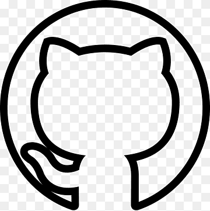

<!-- LALALAL >
<!-- IMAGEM USANDO MARKDOWN
-->
<!-- 

    

 -->

<!-- # TITULO O QUE É MARKDOWN?
## TITULO É UMA LINGUAGEM DE MARCAÇÃO 
###### ANIMAL!!!!!!!!!!!!!!!!!

<H1> SOCORROOOO </H1>
<H6> O  ENZO ESTÁ ME MATANDOOOOOOO</H6> -->

 

## DESCRIÇÃO DO PROJETO

 
Estamos aprendendo html no git hub  Estamos aprendendo html no git hub Estamos aprendendo html no git hub Estamos aprendendo html no git hub Estamos aprendendo html no git hub Estamos aprendendo html no git hub Estamos aprendendo html no git hub Estamos aprendendo html no git hub Estamos aprendendo html no git hub 

Estamos aprendendo html no git hub Estamos aprendendo html no git hub Estamos aprendendo html no git hub          Estamos aprendendo html no git hub Estamos aprendendo html no git hub Estamos aprendendo html no git hub Estamos aprendendo html no git hub Estamos aprendendo html no git hub 

## Tabela de conteúdinhos

<ul>
    <li> Enzo Rincon </li>
    <li><A href="#tabela-de-conteúdinhos">  testeeeee lalalala</A></li>
    <li><a href="#StatusProjeto">Status do Projetin</a></li>

</ul>

<a href ="#descriçãoProjeto"> Descrição</a> | 
<a href ="#descriçãoProjeto"> Descrição</a>

## Status 2 do projeto 
<h4 align="left"> Em construção :rocket : </h4>